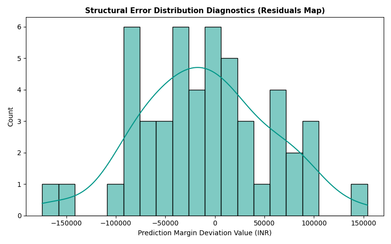

# 🚗 Car Price Prediction with Machine Learning

This repository builds a regression structure to predict market asset valuations using automotive features like brand metrics, horsepower, and mileage dynamics.

### 🎯 Model Error Residual Diagnostics
Below is the error distribution layout tracking the true pricing variables vs prediction deviations:

